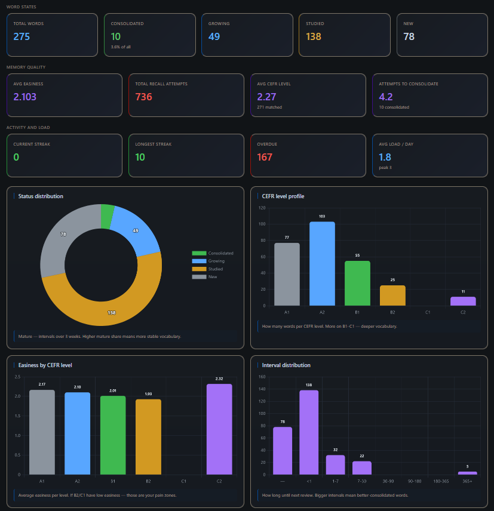
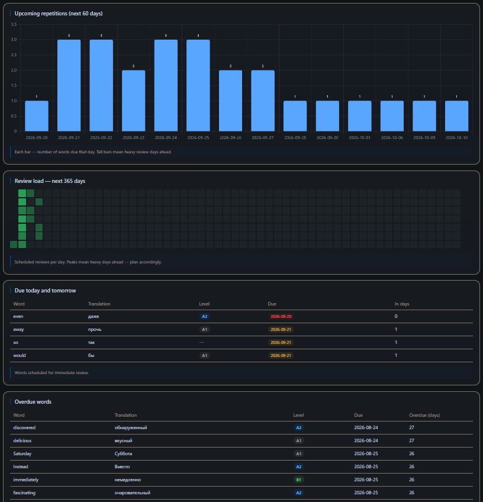
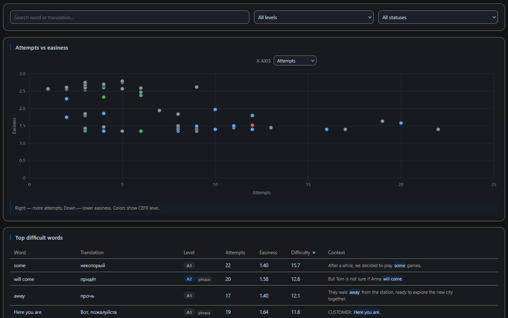
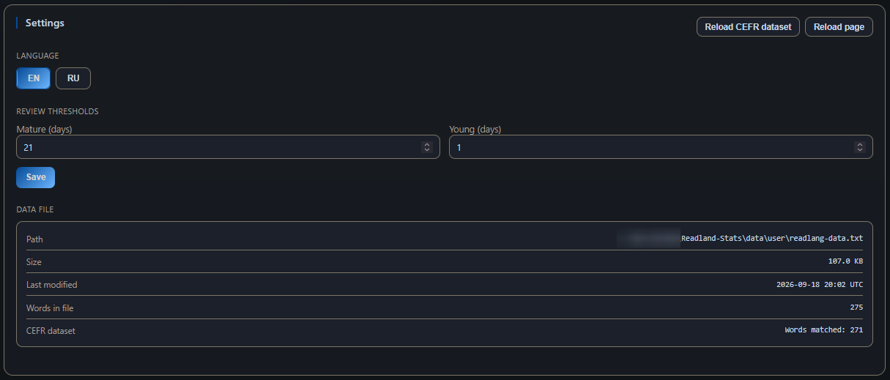

# Readlang Stats

[English](README.md) · **Русский**

[](https://www.python.org/)
[](https://fastapi.tiangolo.com/)
[](https://opensource.org/licenses/MIT)

Локальный дашборд для CSV-экспорта из [Readlang](https://readlang.com/):
аналитика интервального повторения, расписание повторений и встроенный
редактор с массовым редактированием через LLM. Работает целиком на
`localhost` — данные не покидают вашу машину.

## Содержание

- [Возможности](#возможности)
- [Скриншоты](#скриншоты)
- [Требования](#требования)
- [Установка](#установка)
- [Подготовка данных](#подготовка-данных)
- [Запуск](#запуск)
- [Использование](#использование)
- [Массовое редактирование через LLM](#массовое-редактирование-через-llm)
- [Файлы и резервные копии](#файлы-и-резервные-копии)
- [Структура проекта](#структура-проекта)
- [Разработка](#разработка)
- [Лицензия](#лицензия)

---

## Возможности

**Обзор** · **Календарь** · **Слова** · **Редактор** · **Настройки** — пять
экранов, каждый отвечает на один вопрос. Подробности — в разделе
[Использование → Вкладки](#вкладки).

### Сквозные фичи

- **Копирование в Markdown** — на каждой вкладке есть кнопка, которая копирует текущие числа и таблицы в буфер как Markdown. Удобно вставлять в заметки, Obsidian или в чат с LLM.
- **Двуязычный интерфейс** — английский и русский из коробки. Добавить язык — два шага (`static/i18n/xx.json` и `"xx"` в массиве `SUPPORTED` в `static/i18n.js`).
- **Только локально** — приложение слушает `127.0.0.1` и никуда не отправляет ваши данные. Единственный исходящий запрос — загрузка Chart.js с CDN при первом открытии страницы.

---

## Скриншоты

### Обзор — KPI и графики

*Состояния слов, качество запоминания, активность и нагрузка, профиль CEFR, фактор легкости по уровням, распределение интервалов.*

### Календарь — что к повторению и что просрочено

*Прогноз повторений на 60 дней, тепловая карта нагрузки на год, слова на сегодня и завтра, список просроченных.*

### Слова — найти самые сложные

*Диаграмма рассеяния (попытки × фактор легкости, цвет = уровень CEFR) рядом с сортируемой таблицей самых сложных слов.*

### Редактор — ручное и массовое редактирование

*Ручное редактирование с живым превью контекста плюс экспорт/импорт JSON для массового редактирования через LLM.*

### Настройки

*Язык интерфейса, пороги SRS, перезагрузка датасета CEFR, информация о файле данных.*

---

## Требования

- **Python 3.10 или новее**.
- CSV-экспорт Readlang, положенный в `data/user/readlang-data.txt`.
- Современный браузер.

При первом открытии страница загружает Chart.js и плагин datalabels с
`cdn.jsdelivr.net` — то есть интернет нужен один раз. После этого всё
работает офлайн.

---

## Установка

```bash
git clone https://github.com/OlyoshaOlyosha/Readland-Stats
cd Readland-Stats

python -m venv .venv
source .venv/bin/activate          # Windows: .venv\Scripts\activate

pip install -r requirements.txt
```

---

## Подготовка данных

### 1. Экспорт Readlang (обязательно)

В Readlang экспортируйте слова в CSV и сохраните файл как:

```
data/user/readlang-data.txt
```

Приложение разбирает только секцию `Your words (csv format)` и оставляет
все остальные секции файла побайтово нетронутыми при записи. Пустые строки
игнорируются.

### 2. Датасет CEFR (опционально)

Чтобы рядом с каждым словом отображался уровень CEFR, положите CSV в:

```
data/cefr_mega_dataset.csv
```

Названия колонок сопоставляются без учёта регистра и гибко:

- колонка со словом: `word`, `headword`, `term` или `lemma`
- колонка с уровнем: `cefr`, `cefr_level` или `level`
- значения уровня: `A1`, `A2`, `B1`, `B2`, `C1`, `C2`

Если файл отсутствует или нечитаем, приложение всё равно работает —
у каждого слова просто будет показан неизвестный уровень. Перезагрузить
датасет без перезапуска можно через **Настройки → Перезагрузить датасет
CEFR**.

---

## Запуск

```bash
python main.py
```

Затем откройте <http://127.0.0.1:8000> в браузере.

Автоперезагрузка отключена по умолчанию (`DEBUG = False` в `app/config.py`).
Включите её там же, если работаете над бэкендом.

---

## Использование

### Вкладки

| Вкладка | Что показывает |
|---|---|
| **Обзор** | KPI за всё время, карточки статуса/качества/активности и сетка графиков: фактор легкости, интервалы, самооценка при повторении, недельный темп, время дня, CEFR, накопленный рост и годовая тепловая карта активности. |
| **Календарь** | Взгляд вперёд: повторения на ближайшие 60 дней, тепловая карта нагрузки на 365 дней, слова на сегодня/завтра и просроченные. |
| **Слова** | Фильтр по уровню, статусу или тексту; сортировка по слову, переводу, уровню, попыткам, фактору легкости или сложности; смена размера страницы; переключение оси X на диаграмме рассеяния. |
| **Редактор** | Редактирование слова / перевода / контекстов. При переименовании новая форма должна встречаться в контекстах — иначе бэкенд отклонит изменение. |
| **Настройки** | Переключение языка, пороги SRS, перезагрузка датасета CEFR, информация о файле данных. |

### Пороги SRS

Два порога определяют статусы:

- **`mature_days`** (по умолчанию **21**) — интервал в днях, начиная с
  которого слово считается *зрелым*.
- **`young_days`** (по умолчанию **1**) — нижняя граница для *молодых*;
  интервалы ниже, но не пустые — это *изучаемые*.

Изменяются в **Настройки → Пороги повторений**. Значения ограничиваются
снизу единицей и сохраняются в `data/settings.json`.

### Горячие клавиши

- `1`–`5` — переход на соответствующую вкладку.
- `/` — фокус на поле поиска активной вкладки.
- `Esc` — закрыть модалку редактирования или массового редактирования.

---

## Массовое редактирование через LLM

На вкладке «Редактор» есть трёхшаговый сценарий для чистки большого числа
слов сразу: экспортируйте текущий фильтр в JSON, отдайте его LLM, вставьте
ответ обратно, просмотрите посимвольный diff, примените. Бэкенд делает одну
резервную копию и пишет один раз — невалидные элементы пропускаются,
валидные применяются.

<details>
<summary>Полный сценарий, формат JSON и правила конфликтов</summary>

### 1. Экспорт JSON

Нажмите **Экспорт JSON** в редакторе. Слова из текущего фильтра копируются
в буфер обмена как JSON-массив объектов `{ word, translation, contexts }`,
отсортированный по сложности.

### 2. Вставка ответа

Нажмите **Вставить JSON**, отправьте массив в LLM и вставьте его ответ в
текстовое поле. Ответ должен быть тем же массивом:

- `word` — это **якорь**: он определяет строку и не должен меняться.
- Чтобы **переименовать**, добавьте поле `new_word` (новая форма должна
  встречаться в новых контекстах, иначе строка будет помечена
  `not_in_context`).
- Переносы строк внутри значений экранируются как `\n`.

### 3. Предпросмотр и применение

Нажмите **Разобрать и показать**. Для каждого изменённого поля отображается
посимвольный diff (красное — удалено, зелёное — добавлено). Строки с
конфликтами (пустое значение, дубликат слова, слова нет в контекстах) не
выбираются автоматически — исправьте их или снимите галочку. Чипы
фильтруют по полю или показывают только конфликты, кнопки выбора
переключают строки массово.

Когда вы нажимаете **Применить**, бэкенд пишет всё **одним** проходом:

- делает **одну резервную копию** CSV в `data/backups/`
- применяет все валидные изменения
- возвращает результат по каждому элементу; ошибки показываются тостом

</details>

---

## Файлы и резервные копии

| Путь | Назначение |
|---|---|
| `data/user/readlang-data.txt` | Ваш экспорт Readlang. Перезаписывается только секция `Your words`. |
| `data/cefr_mega_dataset.csv` | Опциональный датасет для CEFR. |
| `data/settings.json` | Сохранённый язык интерфейса, `mature_days`, `young_days`. |
| `data/backups/` | Резервные копии CSV с меткой времени, создаются перед любой записью. Формат: `readlang-data-YYYYMMDD-HHMMSS.txt`. |

Резервные копии создаются автоматически редактором одного слова **и**
массовым редактором — состояние до правки всегда есть на диске.

---

## Структура проекта

```
Readland-Stats/
├── app/                 # Приложение FastAPI
│   ├── api.py           # HTTP-эндпоинты (words, stats, settings, CEFR)
│   ├── cefr.py          # Загрузчик CEFR CSV + поиск слова/фразы
│   ├── config.py        # Пути, хост/порт, пороги SRS
│   ├── data_manager.py  # Чтение/запись CSV Readlang, резервные копии
│   ├── main.py          # Приложение FastAPI: маршруты, static, index
│   ├── models.py        # Датакласс WordEntry (строка CSV)
│   ├── settings.py      # Чтение/запись settings.json с кэшем
│   └── stats.py         # Вся аналитика (чистый Python, без pandas)
├── data/                # Данные пользователя + бэкапы (в .gitignore)
├── static/              # JS/CSS/i18n
│   ├── i18n/{en,ru}.json
│   ├── app.js
│   ├── i18n.js
│   └── style.css
├── web/index.html       # Единственная HTML-страница
├── main.py              # Лончер `python main.py`
├── requirements.txt     # fastapi, uvicorn[standard]
└── pyproject.toml       # Только конфиг Ruff
```

---

## Разработка

### Запуск с автоперезагрузкой

1. Установите `DEBUG = True` в `app/config.py`.
2. Запустите `python main.py` — Uvicorn будет перезагружаться при каждом
   сохранении.

### Линт и форматирование

```bash
ruff check .
ruff format .
```

Ruff настроен на `py310`, строки в 120 символов и набор правил pycodestyle,
Pyflakes, bugbear и tryceratops — см. `pyproject.toml`.

### Архитектура

Всё работает в одном процессе — ни базы данных, ни фоновых задач. Поток
данных однонаправленный:

```
data/user/readlang-data.txt
        │
        ▼
   data_manager   парсит только секцию "Your words"
        │
        ▼
      stats       аналитика на чистом Python, без pandas
        │
        ▼
       api        эндпоинты FastAPI под /api/*
        │
        ▼
   static/app.js  забирает JSON, рисует таблицы и графики Chart.js
```

Настройки сохраняются в `data/settings.json`; каждая запись проходит через
`data_manager.backup_csv()`, так что резервные копии всегда есть в
`data/backups/`.

### Добавление языка

1. Положите `static/i18n/xx.json` рядом с `en.json` / `ru.json`.
2. Добавьте `"xx"` в массив `SUPPORTED` в начале `static/i18n.js`.

Переключатель языка в настройках подхватит его автоматически.

### Участие в разработке

Issues и pull request'ы приветствуются. Формального процесса пока нет — для
чего-то нетривиального откройте issue заранее, чтобы мы согласовали форму
до того, как вы напишете код. Мелкие правки (опечатки, документация,
очевидные баги) можно сразу присылать PR'ом.

---

## Лицензия

MIT — см. [LICENSE](LICENSE).